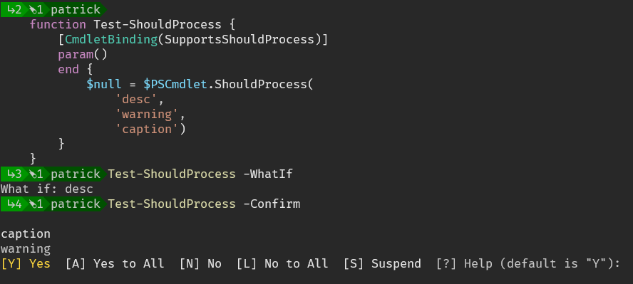

[↑ Go Back](./..)

- [Experimenting with custom ShouldProcess output](#experimenting-with-custom-shouldprocess-output)
- [Objects From `-WhatIf`](#objects-from--whatif)
- [Main Demo : `Test-ShouldProcessReason`](#main-demo--test-shouldprocessreason)
- [Minimal Visual ShouldProcess Test](#minimal-visual-shouldprocess-test)
- [How to Hide default output](#how-to-hide-default-output)


## Experimenting with custom ShouldProcess output


- This is very much a WIP / the code needs cleanup, but it's mostly functional. 
- I'm experimenting with different types of formatting for `ShouldProcess`. 
- Some examples use controlled formatting before and inside the default prompts of `-WhatIf` behavior
- some write to the information stream, view it using `-infa Continue`

## Objects From `-WhatIf`

Cases like copying a nested list of files from one path to another, preserving their relative paths -- cannot be read easily using `-WhatIf` or `-Confirm`

In this case I chose to return objects for `-TestOnly` instead of `-WhatIf` . 


```powershell
| Get-ChildItem $Source -recurse
| ...
| Copy-RelativeItemTree -SourceRootDir $source -DestinationRootDir $dest -TestOnly
```


## Main Demo : `Test-ShouldProcessReason`

- Main Demo [Testing all ShouldProcess Modes.ps1](./Testing%20all%20ShouldProcess%20Modes.ps1)


try
```powershell
Test-ShouldProcessReason 3
Test-ShouldProcessReason 3 -infa Continue
Test-ShouldProcessReason 5
```
## Minimal Visual ShouldProcess Test


- helper functions [ShouldProcess.Utils.ps1](ShouldProcess.Utils.ps1)
- [ShouldProcess-FrontHeader.ps1](ShouldProcess-FrontHeader.ps1)
  - A basic prompt, to test how different (hosts) render the default styles.
- For this context, "hosts" is still your machine
- Run `Pwsh` and the terminal and there's one host, run `VS Code` and it has a different host


## How to Hide default output

Here's the call to hide output:

```ps1
$Reason = [System.Management.Automation.ShouldProcessReason]::WhatIf

"$OutputFormat = `$MessageString `$TargetName, `$OperationName, [ref]`$Reason"
if ($PSCmdlet.ShouldProcess($MessageString, $TargetName , $OperationName, [ref]$reason)) {
    # "Execute Item: `$MessageString `$TargetName, `$OperationName, [ref]`$Reason"
    $InputNames | ForEach-Object { "${ItemString}: $_" }
}
```




