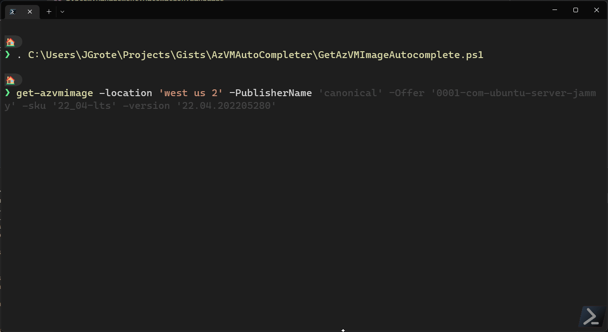

## About

Autocompleter for Get-AzVmImage

## Source 

- [GetAzVMimageAutocomplete gist](https://gist.github.com/JustinGrote/edc138ba42be746280ae2ae2f27baf75)

- [Tweet](https://twitter.com/JustinWGrote/status/1531736977720061952)

> Another mind-numbingly bad #Azure #PowerShell example that could be so much easier with just a couple autocompleters. <https://docs.microsoft.com/en-us/azure/virtual-machines/windows/cli-ps-findimage#list-images>

