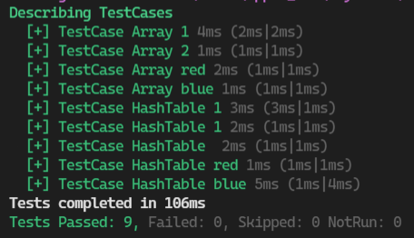
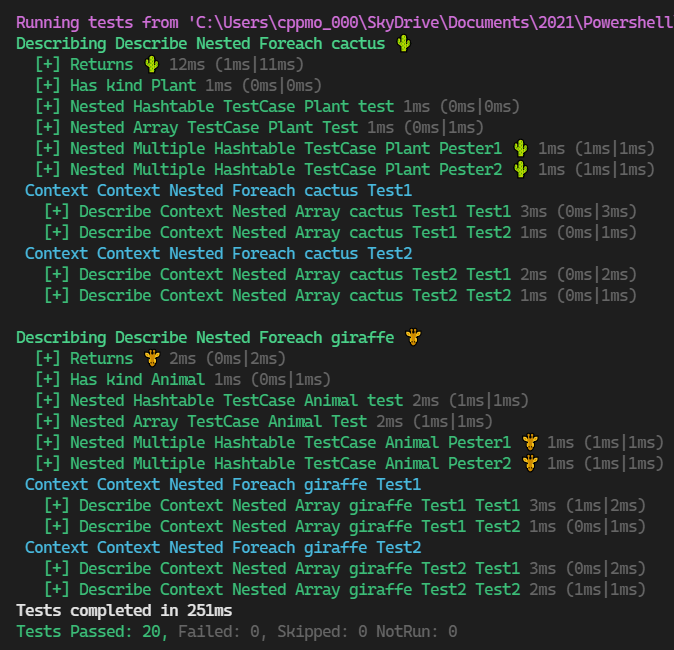

- [Docs](#docs)
- [Code](#code)
- [Visual Cheatsheet - Data driven Pester tests](#visual-cheatsheet---data-driven-pester-tests)
  - [Ex1 `Array-TestCases.tests.ps1`](#ex1-array-testcasestestsps1)
  - [Ex 2 `Three-Layers-of-Nested-TestCases.tests.ps1`](#ex-2-three-layers-of-nested-testcasestestsps1)
- [Using:](#using)
  - [`It -ForEach <inputs>`](#it--foreach-inputs)
  - [`Describe -ForEach <inputs>`](#describe--foreach-inputs)

## Docs

Official [pester docs](https://pester.dev/docs/quick-start)
- [data-driven-tests](https://pester.dev/docs/usage/data-driven-tests)
- [discovery-and-run](https://pester.dev/docs/usage/discovery-and-run)


## Code

- [Array-TestCases.tests.ps1](Array-TestCases.tests.ps1)
- [Three-Layers-of-Nested-TestCases.tests.ps1](Three-Layers-of-Nested-TestCases.tests.ps1)


## Visual Cheatsheet - Data driven Pester tests

### Ex1 `Array-TestCases.tests.ps1`

- [Array-TestCases.tests.ps1](Array-TestCases.tests.ps1)




```powershell
Describe 'TestCases' {
    It 'TestCase Array <_>' {
        $_ | Should -Not -BeNullOrEmpty
    } -TestCases @(
        1
        2
        'red'
        'blue'
    )
    It 'TestCase HashTable <Name>' {
        $_ | Should -Not -BeNullOrEmpty
    } -TestCases @(
        @{Name = 1 }
        @{Name = 'red' }
        @{Name = 'blue' }
    )
}
```

### Ex 2 `Three-Layers-of-Nested-TestCases.tests.ps1`

- [Three-Layers-of-Nested-TestCases.tests.ps1](Three-Layers-of-Nested-TestCases.tests.ps1)



```powershell
Describe 'Describe Nested Foreach <name> <symbol>' -ForEach @(
    @{ Name = 'cactus'; Symbol = '🌵'; Kind = 'Plant' }
    @{ Name = 'giraffe'; Symbol = '🦒'; Kind = 'Animal' }
) {
    It 'Returns <symbol>' { $true }

    It 'Has kind <kind>' { $true }

    It 'Nested Hashtable TestCase <kind> <name>' { $true } -TestCases @{
        Name = 'test'
    }
    It 'Nested Array TestCase <kind> <_>' { $true } -TestCases @(
        'Test'
    )
    It 'Nested Multiple Hashtable TestCase <kind> <name> <symbol>' { $true } -TestCases @(
        @{ Name = 'Pester1' }
        @{ Name = 'Pester2' }
    )

    Context 'Context Nested Foreach <name> <ContextValue>' -Foreach @(
        @{ ContextValue = 'Test1' }
        @{ ContextValue = 'Test2' }
    ) {
        It 'Describe Context Nested Array <name> <contextvalue> <_>' -TestCases @(
            'Test1'
            'Test2'
        ) { $true }
    }
}
```

## Using:

### `It -ForEach <inputs>`

note: `It -ForEach` is an alias for `it -TestCases`
```ps1
BeforeAll {
    . $PSCommandPath.Replace('.Tests.ps1', '.ps1')
}

Describe 'Get-Emoji' {
    It 'Returns <expected> (<name>)' -TestCases @(
        @{ Name = 'cactus'; Expected = '🌵' }
        @{ Name = 'giraffe'; Expected = '🦒' }
    ) {
        Get-Emoji -Name $name | Should -Be $expected
    }
}
```

### `Describe -ForEach <inputs>`

```ps1
Describe 'Get-Emoji <name>' -ForEach @(
    @{ Name = 'cactus'; Symbol = '🌵'; Kind = 'Plant' }
    @{ Name = 'giraffe'; Symbol = '🦒'; Kind = 'Animal' }
) {
    It 'Returns <symbol>' {
        Get-Emoji -Name $name | Should -Be $symbol
    }

    It 'Has kind <kind>' { 
        Get-Emoji -Name $name | Get-EmojiKind | Should -Be $kind
    }
}
```
