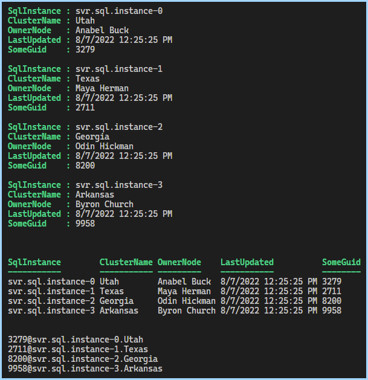
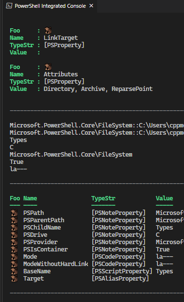

## General Types

- [General Types](#general-types)
  - [Get-HelpFromType](#get-helpfromtype)
- [Update-TypeData](#update-typedata)
  - [SqlClusterdResult.ps1](#sqlclusterdresultps1)
  - [Minimal TypeData Definition](#minimal-typedata-definition)

### Get-HelpFromType

- [Get-HelpFromType](./Get-HelpFromType.ps1)

## Update-TypeData

### SqlClusterdResult.ps1

- [UpdateTypeData: SqlClusterdResult.ps1](./Update-TypeData%20-%20SqlClusterdResult.ps1)

### Minimal TypeData Definition 

- [Minimal-Set-DefaultDisplayPropertySet.ps1](./Minimal-Set-DefaultDisplayPropertySet.ps1)

